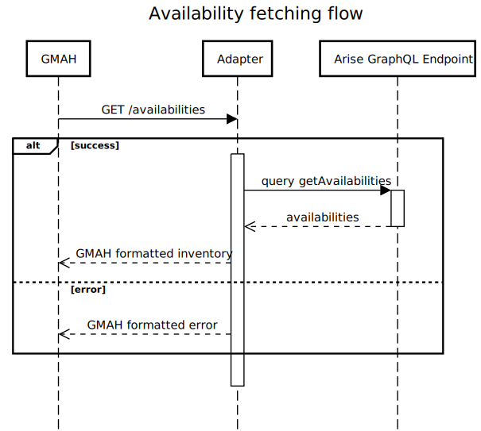
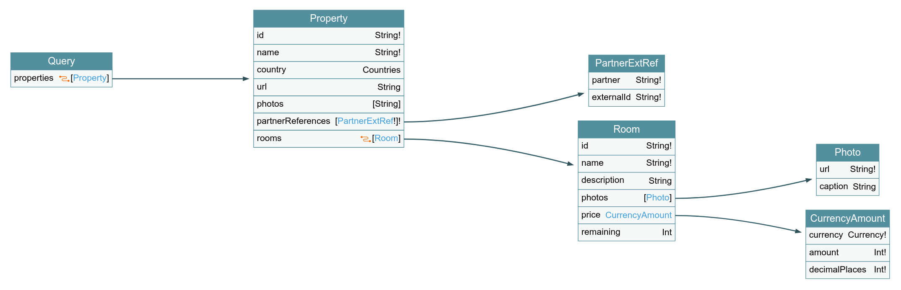
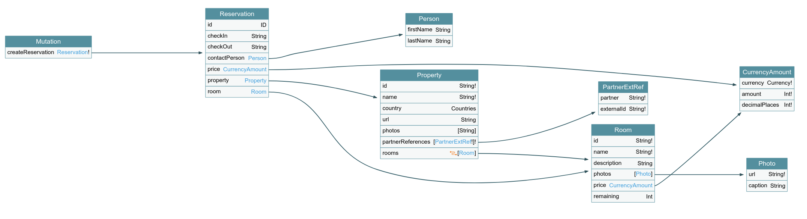

# Arise Backend Technical Test

For the Backend Developer position at Arise, we are looking for a talented
and fast-learning individual to join our team.
This technical test is designed to assess your technical skills and ability to
work with :

- Node.js and JavaScript/TypeScript
- GraphQL endpoints
- Docker
- Third-party APIs

You may use all the time you need to complete this test, but we ask you to **plan
your implementation** and write what you feel best demonstrate your skills within
**60 to 90 minutes**.
Complete as much as you can during that time. We will review your code during
an interview where we will discuss about your design choices and the strategies
you would have planned to implement the complete solution.

**We do not expect you to fully complete that challenge within that time window**.
Feel free to go further, but **keep a track of where you left at the given time limit**.

> If you need any clarifications on the test, please contact Loïc Payol at <loic@arise.travel>

---

## Third-party integration : GiveMeAnHotel.com

Let's consider the hypothetical hotel search engine GiveMeAHotel.com.
GMAH allows end users to search hotels by location, price, and other criteria.
GMAH has now a deal with Arise to build a backend service that would allow them
to search for hotels in real-time. To do so, GMAH pull data from their partners
systems through a standardized API they required to implement. You are assigned
to that integration project and will work on the **implementation of that Adapter**.

### Availability fetching

Whenever a request is made on GMAH's website by a client, GMAH will fetch the
availability of the rooms we have for the hotels matching the client's query.



### Booking

GMAH allows clients to book rooms for their stay directly on the same website.
This allows an higher conversion rate and enhances the overall user experience.


## The Arise GraphQL Endpoint

In order to interact with the Arise network, we created a GraphQL endpoint that
queries and mutates the network states in a convenient interface. For this test,
we created a light version of that schema, with an in-memory database. Mutations
won't be effectful but will behave as if they have successfully saved the data.

The GraphQL endpoint you're going to use is packaged into the Docker Compose
deployment shipped in this repository. The server is exposed on the port **4000**.
You can use the built-in [Altair IDE](http://localhost:4000/altair) to quickly
interact with it.

The GraphQL schema is self documented, but here is a visual representation of the
operations the endpoint exposes.





> *Generated using [GraphQL Voyager](https://apis.guru/graphql-voyager/).*

---

## Tasks

You are asked to **implement the GMAH Adapter**, using the boilerplate code provided
in this repository. **Follow the OpenAPI specifications** in the **`openapi.yaml`** file.
You can use the included `/docs` route to get a generated documentation of the
OpenAPI spec you need to implement.

For development purposes, **a Docker Compose local deployment is provided**. It
launches the mock Arise GraphQL endpoint you'll interact with. To launch it, run:

```shell
docker-compose up -d
GRAPHQL_ENDPOINT=http://localhost:4000/graphql yarn start:dev
```

> For some reason, the `yarn start:dev` command doesn't work inside Docker Compose,
> so please use the following workflow until we find a better solution.

**We do not require a full production ready implementation. Write code that you want
to discuss over in a follow-up interview. Prepare what you think you'll need to
achieve in order to make that project successful. Questions are welcomed during
that review.**

Hovewer, if you choose to continue on the implementation, extra points will be awarded for :

- Code quality
- Network failure management/retry strategies
- Proper validation of the input data
- Correct usage of TypeScript
- Some form of authentication (Basic/JWT/...)

### Submitting your code

Once you're done, publish your code on any open Git platform (GitHub, Gitlab, ...)
and send us the link to your repository.
Self-criticism on your submission is encouraged, but not required.

**Good luck!**
